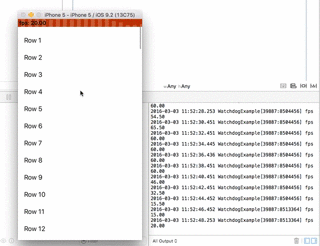

# WatchdogInspector
#### Shows your current framerate (fps) in the status bar of your iOS app
##### Be a good citizen! Don't block your main thread!
[](https://travis-ci.org/tapwork/WatchdogInspector)
[](https://github.com/tapwork/WatchdogInspector/blob/master/WatchdogInspector.podspec)
[](https://github.com/tapwork/WatchdogInspector/blob/master/LICENSE)
[]()
[](https://github.com/Carthage/Carthage)
[](http://twitter.com/cmenschel)

WatchdogInspector counts your app's framerate and displays the fps in the status bar.
The coloured status bar lets you know when your framerate drops below 60 fps.
If everything is fine your status bar gets happy and will stay green.
To detect unwanted main thread stalls you can set a custom watchdog timeout.

## Features
* Status bar displays the current framerate in fps (measured every 2 seconds)
* Colours the status bar from green (good fps) to red (bad fps)
* Custom watchdog timeout: Exception when main thread stalls for a defined time



## Install
#### CocoaPods
```
pod "WatchdogInspector"
```
and run `pod install`
You can see the example project how to setup and run `WatchdogInspector`
Make sure that you **don't** use `WatchdogInspector` in production.

#### Carthage 
You can use [Carthage](https://github.com/Carthage/Carthage). 
Specify in Cartfile:

```ruby
github "tapwork/WatchdogInspector"
```

## Usage
##### [Objective-C](README_objc.md)  |  Swift
#### Start 
After launch or whenever you want.
```Swift
import WatchdogInspector
func application(application: UIApplication, didFinishLaunchingWithOptions launchOptions: [NSObject: AnyObject]?) -> Bool {
        TWWatchdogInspector.start()
        return true
}
```
####Stop
To stop it just call
```Swift
TWWatchdogInspector.stop()
```
#### Main Thread Stalling Exceptions
You can set a custom watchdog timeout for stalling exceptions (Default: 3 seconds)
```Swift
TWWatchdogInspector.setStallingThreshhold(10.0)
```
You could also disable the Main Thread exceptions
```Swift
TWWatchdogInspector.setEnableMainthreadStallingException(false)
```
####Logging
To log all measured framerates you can log them in the console by calling (Default: on)
```Swift
TWWatchdogInspector.setUseLogs(true)
```

## How it works
There are basically two timers running to measure the framerate.

1. The background thread timer fires every 2 seconds to count how many frames were set by the main thread. Ideally the result would be 120 frames in 2 seconds to get 60 fps. The background timer resets the frames counter every event. He also sends the measured fps to the status bar on the main thread.

2. The main thread timer should fire every 1/60 second (60 fps is optimum for a smooth animation) to increment the frames counter. If the main thread is blocked and can't run every 1/60 second the framerate will drop the 60 fps.

There is also a run loop observer running to detect main thread stalls for a defined timeout. If the timeout has been reached an exception will be thrown.

## Related projects
* [HeapInspector](https://github.com/tapwork/HeapInspector-for-iOS)
Find memory issues & leaks in your iOS app

## Author
* [Christian Menschel](http://github.com/tapwork) ([@cmenschel](https://twitter.com/cmenschel))

## License
[MIT](LICENSE)
